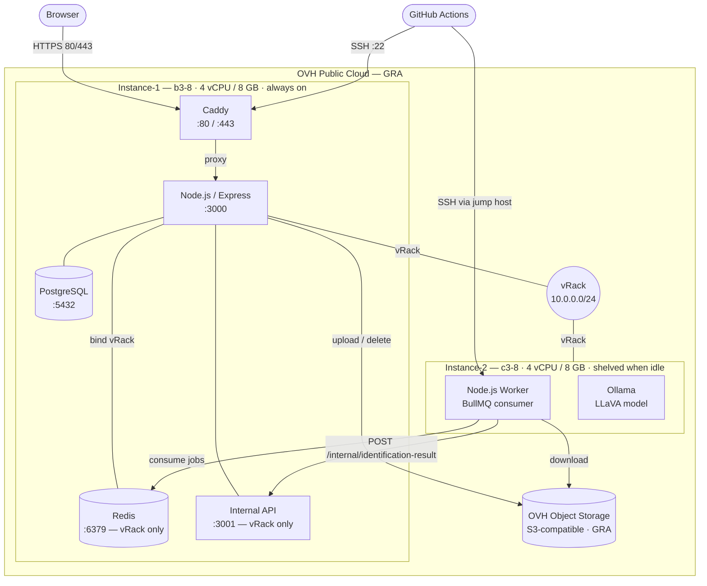
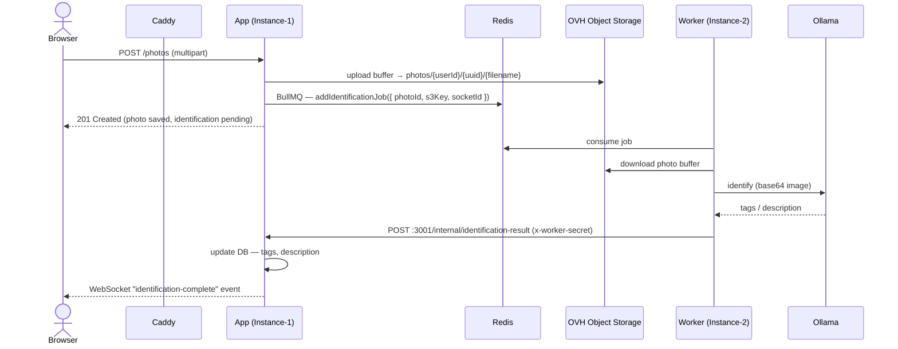
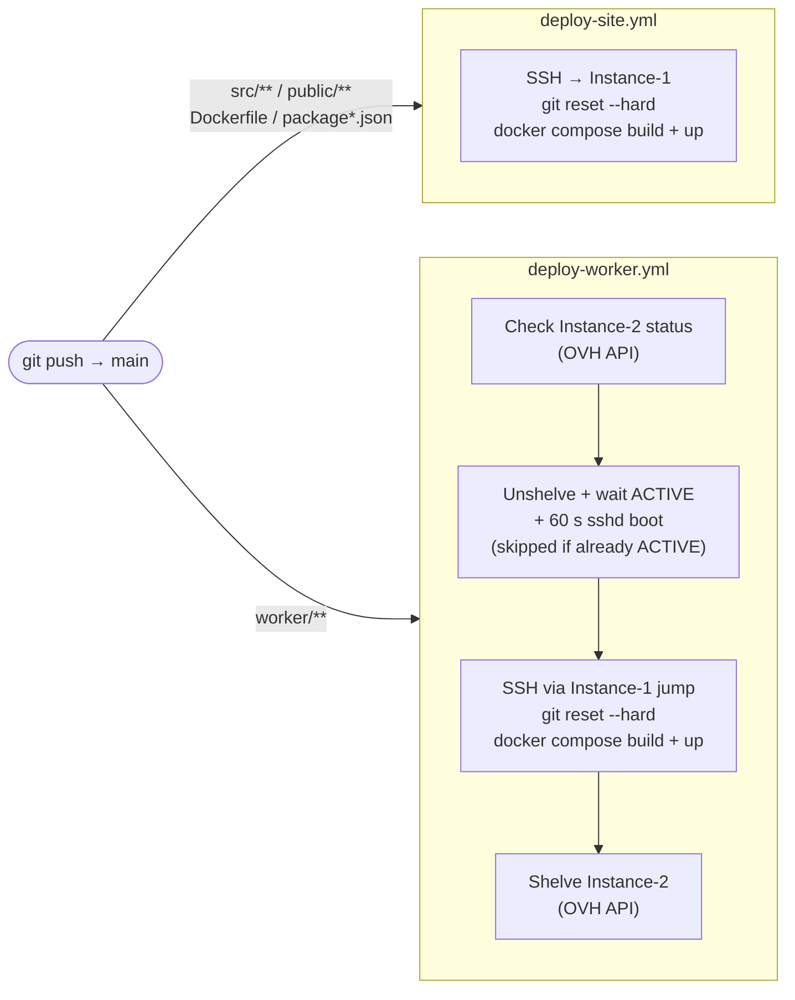

# Architecture — V4

> Updated: 2026-05-25

---

## Infrastructure

---

## Photo upload & AI identification flow

---

## CI/CD

---

## Network rules (ufw)

| Instance | Port | Source | Purpose |
|----------|------|--------|---------|
| Instance-1 | 22 | Anywhere | SSH (GitHub Actions / admin) |
| Instance-1 | 80 / 443 | Anywhere | HTTP / HTTPS (Caddy) |
| Instance-1 | 6379 | 10.0.0.0/24 | Redis (Worker consumer) |
| Instance-1 | 3001 | 10.0.0.0/24 | Internal API (Worker callback) |
| Instance-2 | 22 | 10.0.0.0/24 | SSH via Instance-1 jump host only |

---

## Key design decisions

| Decision | Reason |
|----------|--------|
| Instance-2 shelved when idle | OVH bills shelved instances for storage only (~€0.01/GB/month) vs full flavor price when stopped |
| Redis bound to vRack IP only | Never reachable from the public internet — port mapping `${REDIS_BIND_IP}:6379:6379` on the host |
| Internal API on port 3001 | Separated from the public app port (3000) so Caddy never proxies it |
| `git reset --hard` in deploy | Avoids divergent branch failures when Instance-1 has local commits from manual setup |
| SSH jump host via Instance-1 | Instance-2 has no inbound public SSH — GitHub Actions uses `proxy_host` |
| OVH Object Storage (S3) | Both instances access photos directly — no file transit between them over the vRack |
